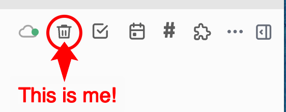
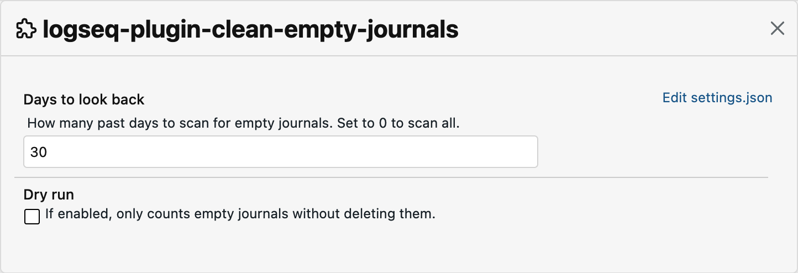

# Clean Empty Journals


A [Logseq](https://logseq.com) plugin that removes empty journal pages from your graph with a single toolbar click.

Logseq automatically creates a journal page for the current day on startup. Over time, days on which you made no notes accumulate as empty pages. This plugin lets you clean them up instantly.

## Features

- Adds a trash-can icon to the Logseq toolbar
- Deletes journal pages that contain no content (or only blank lines)
- Skips today's journal page
- Configurable look-back window (scan only the last N days, or all time)
- Dry run mode to preview what would be deleted without removing anything

## Installation

### From the Marketplace

Search for **Clean Empty Journals** in Logseq's Plugin Marketplace and click Install.

### Manual (unpacked)

1. Enable Developer mode: Settings → Advanced → Developer mode, then restart Logseq.
2. Download or clone this repository.
3. Open Logseq → `...` → Plugins → Load unpacked plugin.
4. Select the plugin folder.

## Usage

Click the trash-can icon in the toolbar. A notification will confirm how many empty journal pages were deleted.



## Settings

| Setting           | Default | Description                                                        |
| ----------------- | ------- | ------------------------------------------------------------------ |
| Days to look back | `30`    | Number of past days to scan. Set to `0` to scan all journal pages. |
| Dry run           | `true`  | Counts empty journals without deleting them. Turn off to actually delete. |

Settings are accessible via Logseq → `...` → Plugins → Clean Empty Journals → Settings.



## Notes

- This plugin works only in the Logseq desktop app. It is not available on mobile or in the browser.
- Today's journal page is always excluded from deletion.
- Journal pages that have content are never affected.

## Development

```bash
npm install
npm run build   # bundles src/main.js to dist/main.js
npm run dev     # rebuild on change
```

Releases are built and published automatically by GitHub Actions when a `v*` tag is pushed (see [.github/workflows/release.yml](./.github/workflows/release.yml)).

## Changelog

See [CHANGELOG.md](./CHANGELOG.md).

## License

MIT
